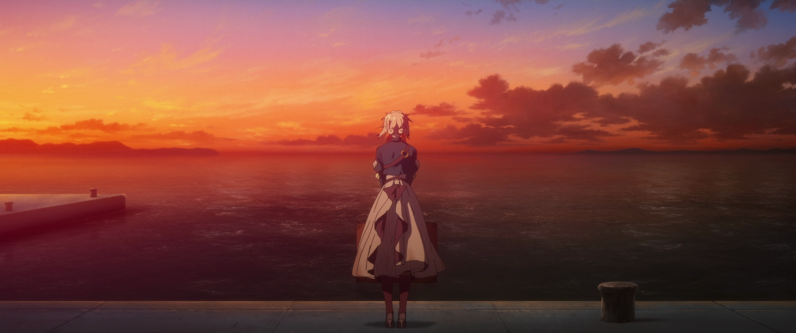

## Review
<iframe width="100%" height="166" scrolling="no" frameborder="no" allow="autoplay" src="https://w.soundcloud.com/player/?url=https%3A//api.soundcloud.com/tracks/434275887&color=%23ff5500&auto_play=false&hide_related=false&show_comments=true&show_user=true&show_reposts=false&show_teaser=true"></iframe>
 · <a href="https://soundcloud.com/sysofanas/never-coming-back" title="Violet Evergarden OST -  Never Coming Back" target="_blank" style="color: #cccccc; text-decoration: none;">Violet Evergarden OST -  Never Coming Back</a>

What is the definition of a masterpiece?. How do we know a piece of work whether it is a beautifully crafted object, words, scientific paper, art, literature, and the never-ending things?.We have rated many things masterpiece without properly knowing what a masterpiece actually is.

This movie in my opinion marks the definition of a masterpiece. One of the best things I have ever felt in my life, the emotions that I usually ignored came ... . I learned the meaning of those feeling which I thought I know to the fullest.

Thank you KyoAni for producing this masterpiece and making me enjoy your work.

## About the anime.
Trailer

<iframe width="560" height="315" src="https://www.youtube.com/embed/NSIzsFOfd8M" title="YouTube video player" frameborder="0" allow="accelerometer; autoplay; clipboard-write; encrypted-media; gyroscope; picture-in-picture" allowfullscreen></iframe>

More: [MyAnimeList](https://myanimelist.net/anime/37987/Violet_Evergarden_Movie) , Watch on [Netflix](https://www.netflix.com/title/81193214)  

## Video essay on the movie.

<iframe width="560" height="315" src="https://www.youtube.com/embed/TEOrPKlgQaQ" title="YouTube video player" frameborder="0" allow="accelerometer; autoplay; clipboard-write; encrypted-media; gyroscope; picture-in-picture" allowfullscreen></iframe>

<iframe width="560" height="315" src="https://www.youtube.com/embed/d_fMfH3ew4U" title="YouTube video player" frameborder="0" allow="accelerometer; autoplay; clipboard-write; encrypted-media; gyroscope; picture-in-picture" allowfullscreen></iframe>

## A Tribute to Violet Evergarden.
Here is my artwork i made using blender for this beloved anime.

