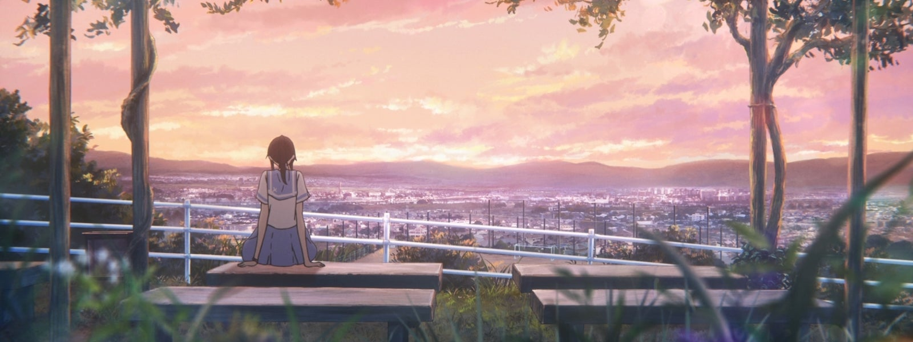

## Review

"Liz and the bluebird" is a tale of two beautiful friendships and it's in a special place in my heart. This movie tells you the story of two best friends who never want to leave their path but they have to in order to go on their journey. Mizore and Nozomi are the main cast of this film, Mizore is a quiet girl who loves and wants to follow her best friend Nozomi but in order to carve their path they have to free themselves from each other to make them grow even more.

This movie hits hard on my face as I was in the same situation as Mizore and Nazomi back in my high school days. It was hard to leave behind my best friend in order to pursue something I like. My friend and I never wanted to leave each other and thought we could continue the same path and go together. But life is unpredictable and I wanted to go to this college that I like which was far away from my state and my friend wanted to study near the state. As we know we have to keep flowing in order to reach the destination we wanted to reach and later we parted away towards our chosen paths in order to pursue our passions.

This movie tells and shows the emotions of parting away of two best friends in order to pursue the paths they have chosen, to pursue the goal that almost all of us had or going to have in a beautiful way via Mizore and Nozomi.

Thank you KyoAni for this beautiful film.

## About the movie.
Trailer

<iframe width="560" height="315" src="https://www.youtube.com/embed/QR33NrbOUgE" title="YouTube video player" frameborder="0" allow="accelerometer; autoplay; clipboard-write; encrypted-media; gyroscope; picture-in-picture" allowfullscreen></iframe>

More: [MyAnimeList](https://myanimelist.net/anime/35677/Liz_to_Aoi_Tori) , Watch on [Netflix](https://www.netflixmovies.com/liz-and-the-blue-bird-2018#)  

## Few essay videos on the movie.

<iframe width="560" height="315" src="https://www.youtube.com/embed/uxoNrup1y5g" title="YouTube video player" frameborder="0" allow="accelerometer; autoplay; clipboard-write; encrypted-media; gyroscope; picture-in-picture" allowfullscreen></iframe>

<iframe width="560" height="315" src="https://www.youtube.com/embed/Mr-s7c_WY60" title="YouTube video player" frameborder="0" allow="accelerometer; autoplay; clipboard-write; encrypted-media; gyroscope; picture-in-picture" allowfullscreen></iframe>

<iframe width="560" height="315" src="https://www.youtube.com/embed/uuOhw4tfRQw" title="YouTube video player" frameborder="0" allow="accelerometer; autoplay; clipboard-write; encrypted-media; gyroscope; picture-in-picture" allowfullscreen></iframe>

<iframe width="560" height="315" src="https://www.youtube.com/embed/fUMlCKRUqcw" title="YouTube video player" frameborder="0" allow="accelerometer; autoplay; clipboard-write; encrypted-media; gyroscope; picture-in-picture" allowfullscreen></iframe>

