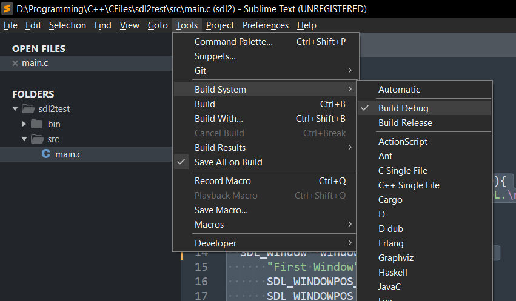

Listen to this playlist while following the tutorial.
<iframe width="100%" height="166" scrolling="no" frameborder="no" allow="autoplay" src="https://w.soundcloud.com/player/?url=https%3A//api.soundcloud.com/tracks/10389033&color=%23ff5500&auto_play=false&hide_related=false&show_comments=true&show_user=true&show_reposts=false&show_teaser=true"></iframe><div style="font-size: 10px; color: #cccccc;line-break: anywhere;word-break: normal;overflow: hidden;white-space: nowrap;text-overflow: ellipsis; font-family: Interstate,Lucida Grande,Lucida Sans Unicode,Lucida Sans,Garuda,Verdana,Tahoma,sans-serif;font-weight: 100;"><a href="https://soundcloud.com/saiko666" title="Saiko" target="_blank" style="color: #cccccc; text-decoration: none;">Saiko</a> · <a href="https://soundcloud.com/saiko666/force-of-nature-just-forget" title="Force Of Nature  - Just Forget" target="_blank" style="color: #cccccc; text-decoration: none;">Force Of Nature  - Just Forget</a></div>

<p>
I wrote this tutorial as there was no good tutorial on internet on how to setup
sublime text for developing sdl2 ptoject using C programming language that actually compiles and works.
</p>

First of all you need to have [Sublime Text](https://www.sublimetext.com/3) installed on your system.
So, now let's get the SDL2 on your system.
### For Window user
1. I assume that you already have mingw on your system. if not install it from here [Mingw](https://sourceforge.net/projects/mingw/files/latest/download) and try running ```gcc``` on cmd to see if it is working.
2. Download the SDL2 from [here](https://github.com/libsdl-org/SDL/releases/tag/release-2.24.1) and choose the one with ```mingw.zip```
   
3. Extract the zip and copy the ```x86_64-w64-mingw32``` folder and create a folder name Dev to you local drive C and paste it there.
And rename it to ```SDL2``` for simplicity. Now everything is ready to setup for sublime text.

### For Linux user
For linux it is easy to setup sdl2 you just need to run the command lines on your terminal.

1. Open up your terminal and run `sudo apt-get install libsdl2-2.0`
2. After that run `sudo apt-get install libsdl2-dev`

That's all for linux

### Now lets setup Sublime text.
1. Open up sublime text and open a empty folder to store your project files. Create two folders `src` and `bin`. Inside `bin` folder
create two folders `debug` and `release`. The project stucture should lool like this
``` 
project_folder:
    bin:
        debug
        release
    src:
```
2. In the main directory create a file name `sdl2.sublime-project` and save it.
3. Now paste the following code for window system.
```
{
	"folders":
	[
		{
			"path": "bin/..",
			"file_exclude_patterns": ["*.sublime-project"]
		}
	],
	"build_systems":
	[
		{
			"name": "Build Debug",
			"working_dir": "${project_path}",
			"cmd": "gcc -c src/main.c -g -Wall -std=c17 -m64 -I include -I C:/Dev/SDL2/include && gcc *.o -o bin/debug/main -L C:/Dev/SDL2/bin  -lmingw32 -L C:/Dev/SDL2/lib/ -lSDL2main -lSDL2 && start bin/debug/main",
			"selector": "source.c",
			"shell": true		
		},
		{
			"name": "Build Release",
			"working_dir": "${project_path}",
			"cmd": "gcc -c src/main.c -O3 -Wall -std=c17 -m64 -I include -I C:/Dev/SDL2/include && gcc *.o -o bin/release/main -L C:/Dev/SDL2/bin -s -lmingw32 -L C:/Dev/SDL2/lib/ -lSDL2main -lSDL2 && start bin/release/main",
			"selector": "source.c",
			"shell": true
		}
	]
}
```

For Linux 

```
{
	"folders":
	[
		{
			"path": "bin/..",
			"file_exclude_patterns": ["*.sublime-project"]
		}
	],
	"build_systems":
	[
		{
			"name": "Build Debug",
			"working_dir": "${project_path}",
			"cmd": ["gcc -c src/main.c -g -Wall -std=c17 -m64 -I include && gcc *.o -o bin/debug/main -lSDL2main -lSDL2 && ./bin/debug/main"],
			"selector": "source.c",
			"shell": true		
		},
		{
			"name": "Build Release",
			"working_dir": "${project_path}",
			"cmd": ["gcc -c src/main.c -g -Wall -std=c17 -m64 -O3 -I include && gcc *.o -o bin/release/main -s -lSDL2main -lSDL2 && ./bin/release/main"],
			"selector": "source.c",
			"shell": true
		}
	]
}
```
Finally it should look like this


### For windows 
To be able to run sdl2 you need to put the sdl2 dll files on the `debug` and `release` folder.

1. Go to `C:/Dev/SDL2/lib/` and copy the `SDL2.dll` file and paste it into `debug` and `release` folder.

Now you are ready to write some codes.

### For Linux
1. Go to your `root` folder after that to `lib` folder and go to `x86_64-linux-gnu`.
2. Now search for `libSDL2-2.0.so.0.10.0` and copy it.
3. Now paste the copied file to your `debug` folder and rename it to `libSDL2.so`.
4. Now copy the `libSDL2.so` file and paste it to the release folder.

Now we are done for linux and ready to code.

### Code a simple window
Now create a new file `main.c` on the `src` folder.
And paste the following code.
```
#include <SDL2/SDL.h>
#include <stdio.h>
#include <stdlib.h>

#define main SDL_main

int main(int argc, char **argv)
{
  if (SDL_Init(SDL_INIT_EVERYTHING) != 0){
    fprintf(stderr,"Error initilizing SDL.\n");
      return EXIT_FAILURE;
  }
  //Create a sdl window
  SDL_Window *window = SDL_CreateWindow(
      "First Window",
      SDL_WINDOWPOS_CENTERED,
      SDL_WINDOWPOS_CENTERED,
      400,
      400,
      0
    );
  if(!window){
    fprintf(stderr,"Error creating SDL window");
    return EXIT_FAILURE;
  }
  //Create a sdl renderer
  SDL_Renderer *renderer = SDL_CreateRenderer(window,-1,0);
  if(!renderer){
    fprintf(stderr,"Error creating SDL renderer");
    return EXIT_FAILURE;
  }

  while(free){
    SDL_Event event;
    SDL_PollEvent(&event);
    switch(event.type){
      case SDL_QUIT:
        SDL_DestroyRenderer(renderer);
        SDL_DestroyWindow(window);
        SDL_Quit();
        break;
    }
    SDL_SetRenderDrawColor(renderer,255,0,0,255); 
    SDL_RenderClear(renderer);
    SDL_RenderPresent(renderer);

  }
	return 0;
}
```
Now choose the build to `Build debug`



And finaly build and run the code by `CTRL+B`.
Now you can see your window, with this you can create any graphics.


Yaay finally we are running sdl2. Good Job and pat on your back.

``` if you encountered any problem or any questions feel free to write a comment.```
<p align="center">

</p>